# zari

Σχεδιάζουμε ένα ζάρι που μπορούμε να εκτυπώσουμε και να χρησιμοποιήσουμε στα παιχνίδια μας.

Η σχεδίαση γίνεται με το λογισμικό Tinkercad, ή άλλο παρόμοιο.

Βήματα:

1) 
      
|         Βήμα 1,2          |        Βήμα 3,4      |
|:----------------------------------:|:------------------------------------:|
| 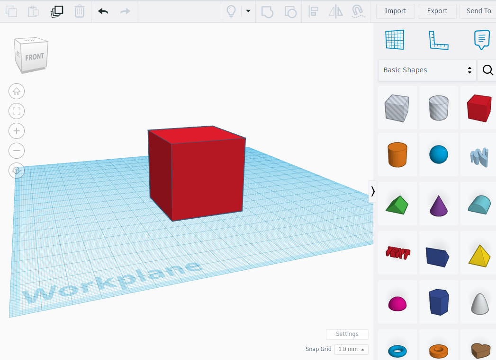 | 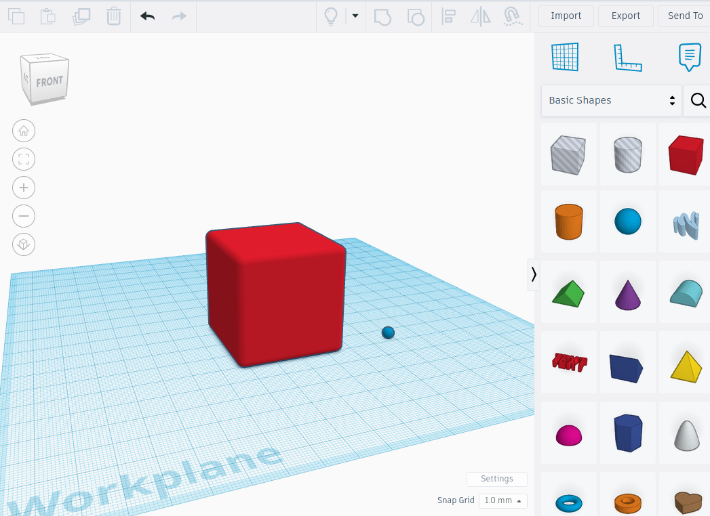 |
|         Βήμα 5,6          |          Βήμα 7           |
| 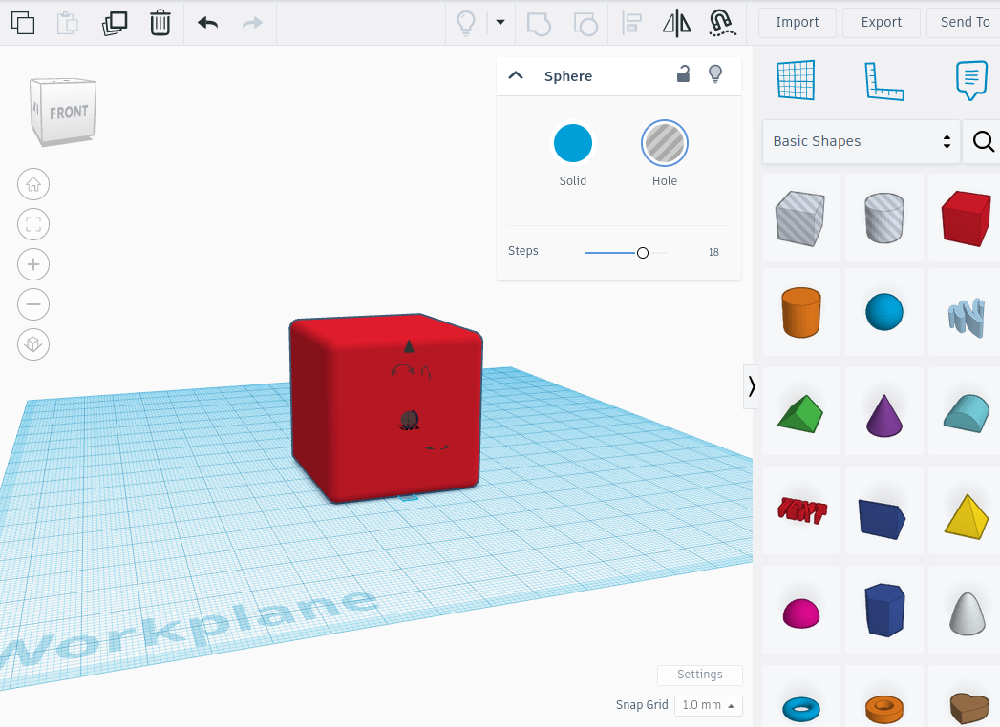 | 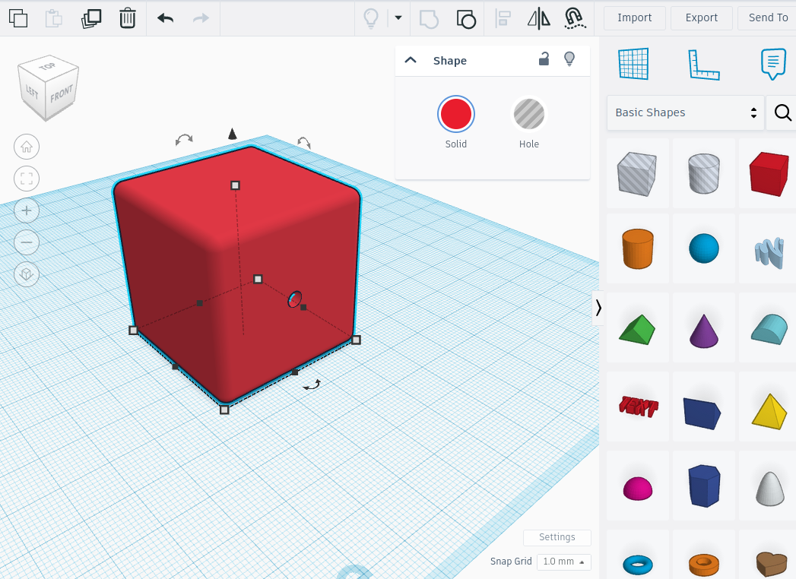 |
|         Βήμα 8           |           Βήμα 9         |
| 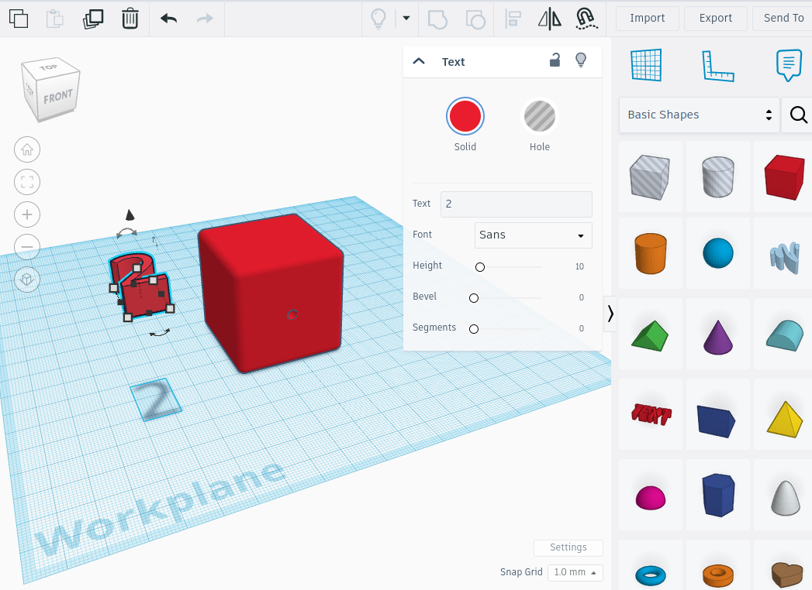 | 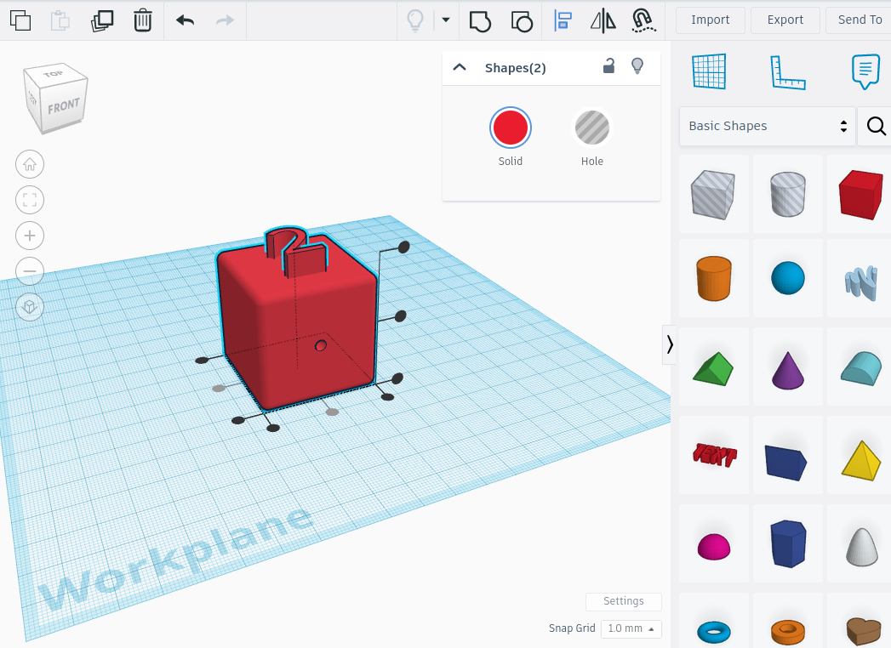 |
|         Βήμα 8           |           Βήμα 9         |
| 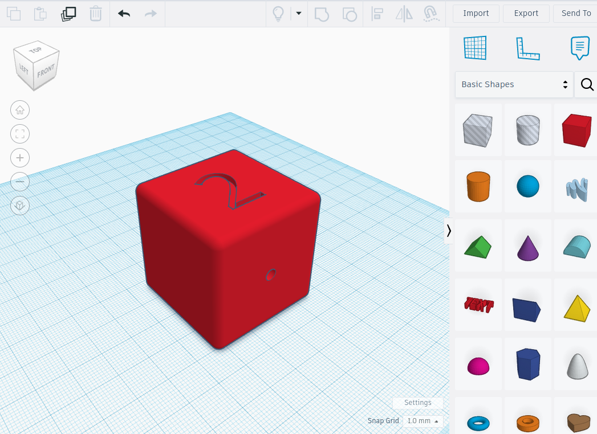 | 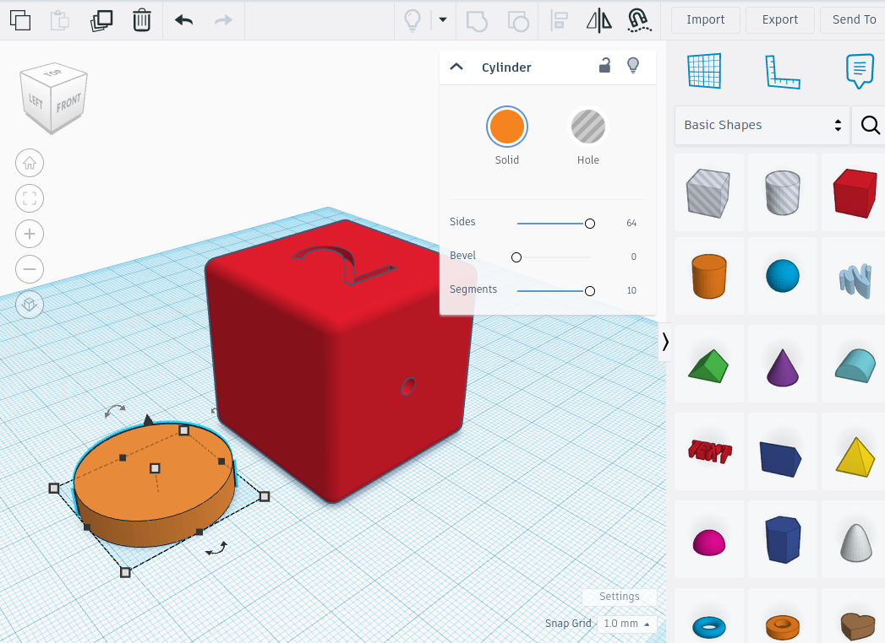 |
|         Βήμα 8           |           Βήμα 9         |
|  | 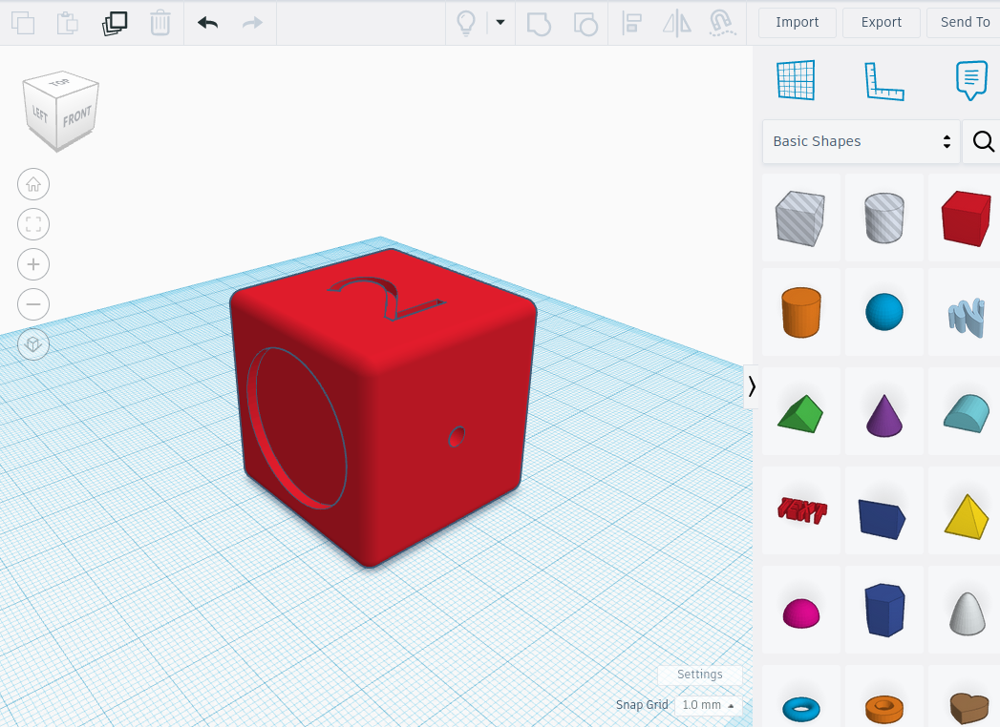 |
|         Βήμα 8           |           Βήμα 9         |
| 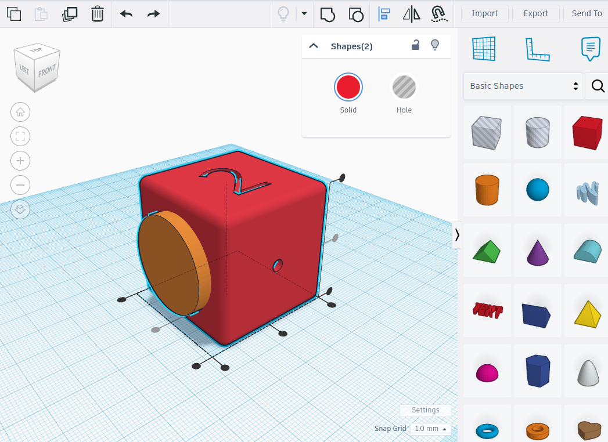 | 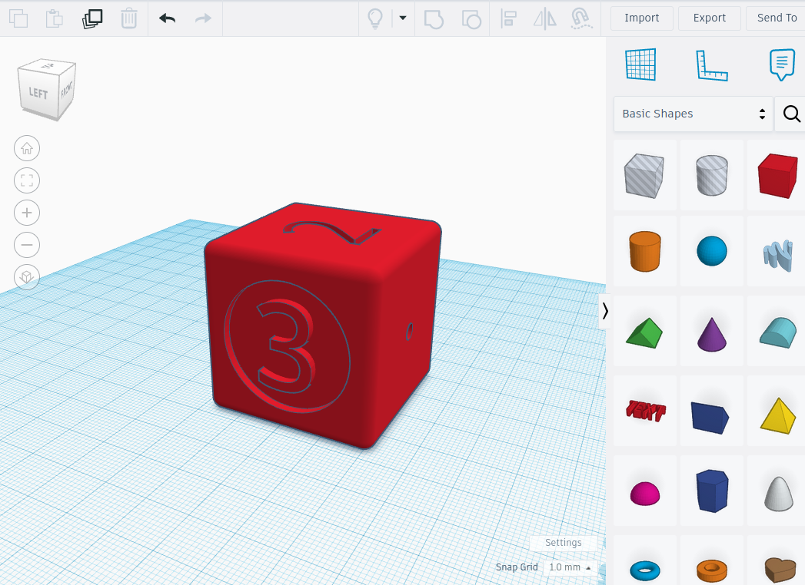 |
